# Naver-Lens: AI-Powered E-Commerce Review Summarizer

### ⭐️ A NAVER Vietnam AI Hackathon 2025 Project ⭐️

<p align="center">
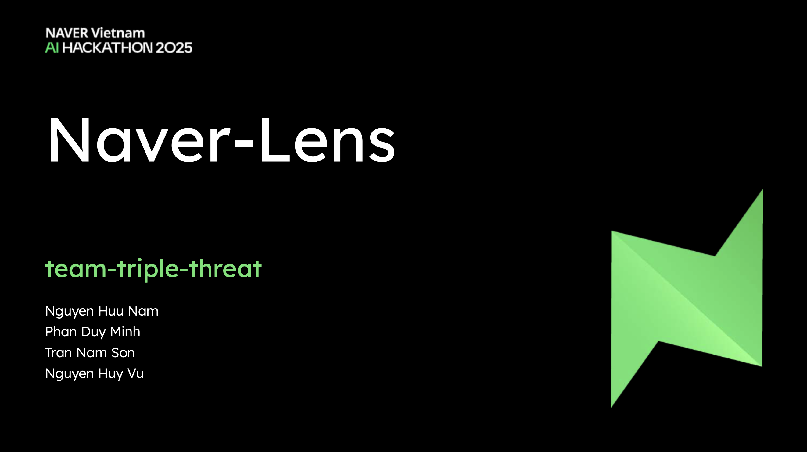 &nbsp; &nbsp;
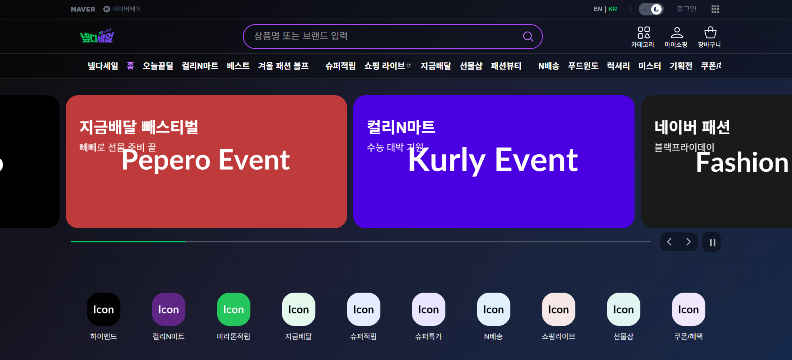
</p>

**Naver-Lens** is a full-stack e-commerce application that enhances the online shopping experience with an integrated AI assistant. Developed for the NAVER Vietnam AI Hackathon, it features a modern shopping interface and provides real-time, structured summaries of product reviews using NAVER's `HyperCLOVA` model.

> _💡 Note: This is an archived showcase of the project. The live `NAVER Cloud` deployment and `HyperCLOVA` AI services were exclusive to the hackathon and are no longer active. This repository has been configured with a "showcase mode" that uses a cached AI response to demonstrate full UI functionality._

## 🎯 My Role & Key Contributions

I was the backend architect and deployment lead on our four-person team, **team-triple-threat**. My key contributions included:

- **System Architecture**: I designed and architected the core `Node.js` backend from the ground up, implementing a modular `MVC` (Model-View-Controller) pattern to ensure a clean separation of concerns and maintainable code under a tight deadline.
- **Cloud Deployment & DevOps**: I provisioned and configured a `Linux VM` on `Naver Cloud Platform` from scratch. I then containerized the application with `Docker` and managed the full production deployment, making our project accessible.
- **Strategy & Presentation**: I co-developed the initial product concept, documented technical requirements, and designed the final presentation slides that we used to pitch our project.

<p align="center">
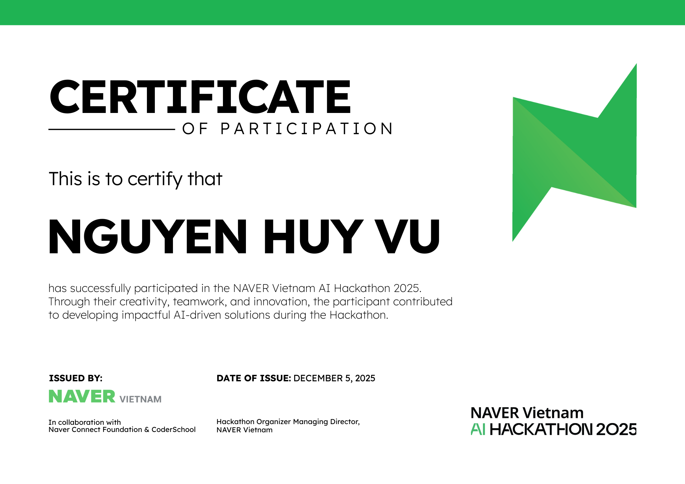
&nbsp; &nbsp;
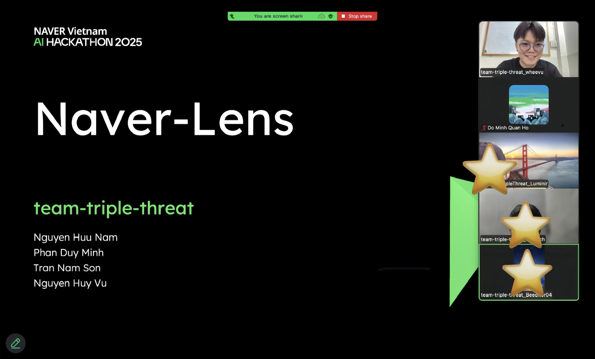
</p>

## 🛠️ Technical Deep Dive

#### Backend (`Node.js` / `Express.js`)

The backend is built on a robust and scalable architecture. It handles product `data management`, `filtering`, `pagination`, and serves as the bridge to the AI service. `Caching` was implemented to optimize performance for frequently accessed product data.

#### 🤖 AI Summarization (`Server-Sent Events`)

The project's core innovation is its AI-powered summary panel. When a user requests a summary, the backend streams the response using `SSE`. This provides a significantly better user experience than waiting for a full response, as the summary appears interactively.

<p align="center">
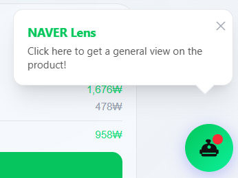
&nbsp; &nbsp;
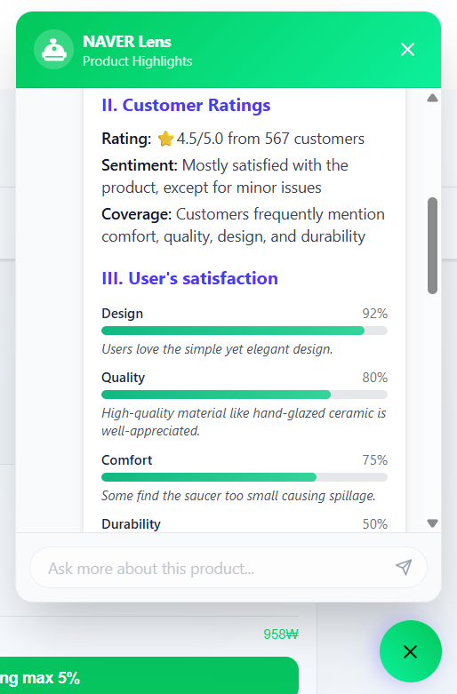
</p>

#### 📊 Database Schema (`MongoDB`)

Product data was modeled using a relational structure within `MongoDB` to accommodate complex product details, including multiple images, nested options, and a list of reviews. This design ensured efficient querying for both the product catalog and the AI summarization context.

<p align="center">
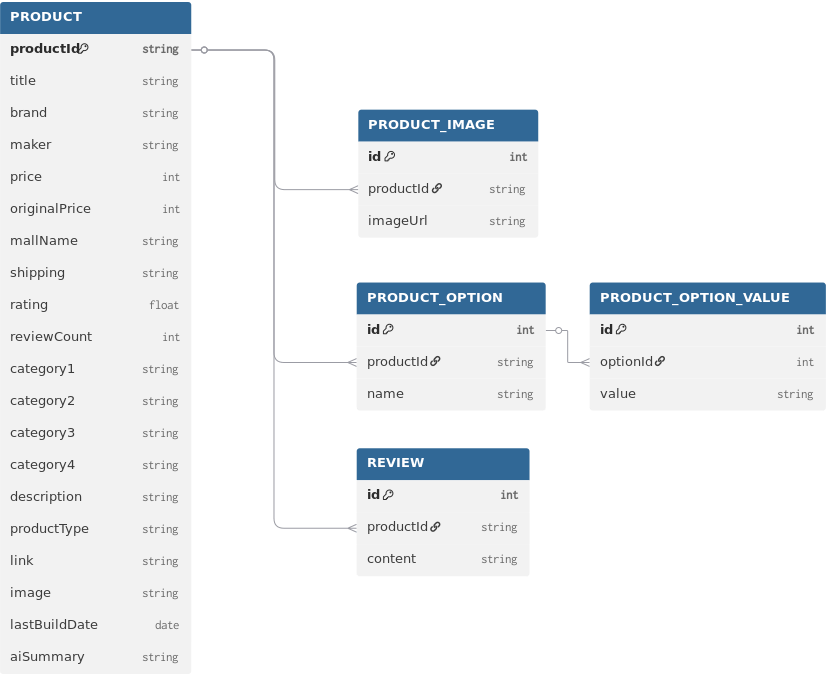
</p>

#### ☁️ Cloud Deployment (`Naver Cloud Platform`)

The entire application was containerized using `Docker` and deployed to a production environment on a `Naver Cloud Platform` server, demonstrating real-world deployment skills beyond local development.

<p align="center">
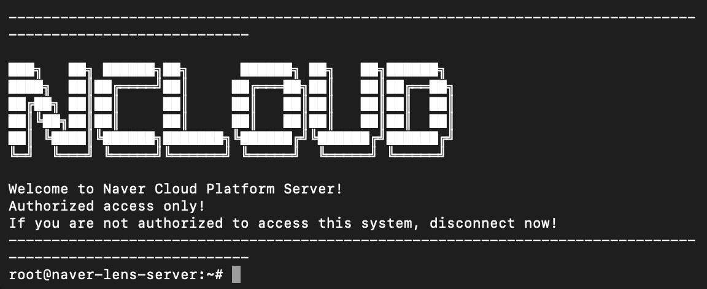
</p>

## ✨ Visual Showcase

The UI was designed to be clean, modern, and intuitive, mirroring the aesthetic of leading e-commerce platforms. It includes light and dark modes, as well as multi-language support (English/Korean).

**🇺🇸/🇰🇷 Homepage**

<p align="center">
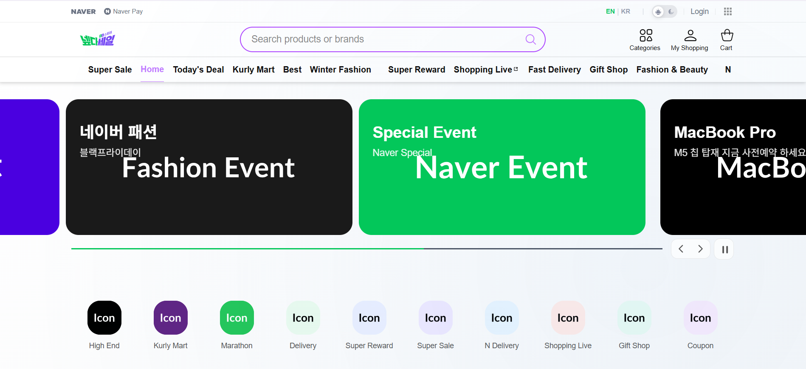 &nbsp; &nbsp;

</p>

**🛒 Product Catalog & Details**

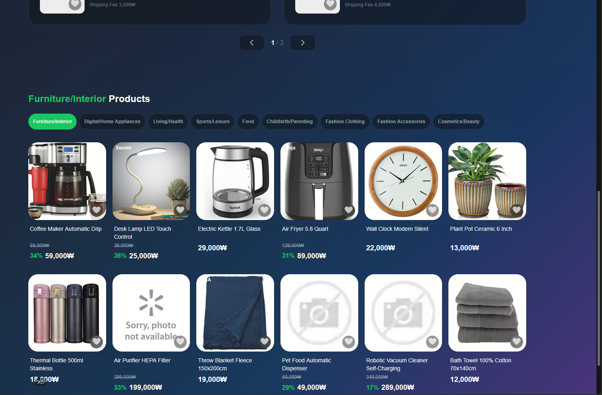 &nbsp; &nbsp;
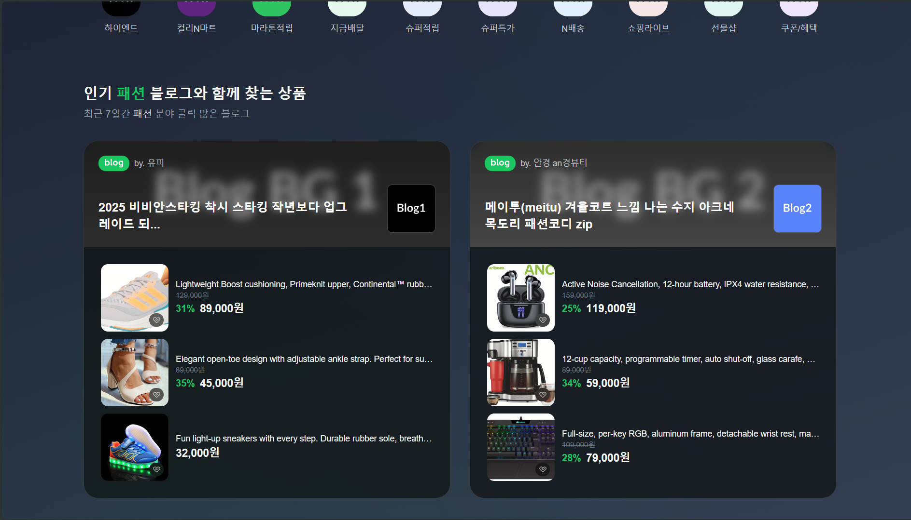 &nbsp; &nbsp;

<p align="center">
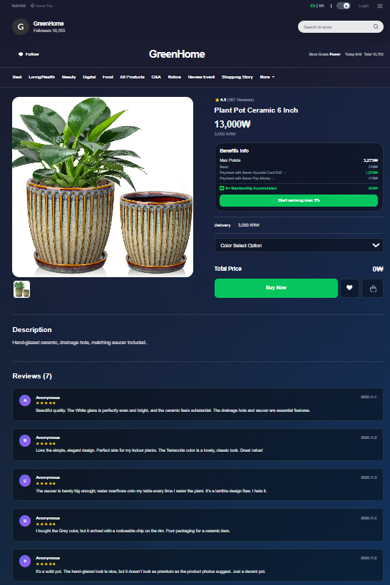
</p>

## 🚀 How to Run (Showcase Mode)

#### 1. Clone the repository

```bash
git clone https://github.com/wheevu/naver-lens.git
cd naver-lens
```

#### 2. Run the Backend

```bash
cd backend
npm install
# Ensure SHOWCASE_MODE=true in .env
npm run dev
```

#### 3. Run the Frontend

```bash
cd frontend
npm install
npm run dev
```

## 💻 Technology Stack

- **Frontend**: `React 19`, `Vite`, `TypeScript`, `TailwindCSS`, `i18next`
- **Backend**: `Node.js`, `Express.js`, `MVC`, `Server-Sent Events (SSE)`
- **Database**: `MongoDB`, `Mongoose`
- **AI**: `NAVER HyperCLOVA` (original), `Mock Service` (showcase)
- **Deployment**: `Docker`, `Naver Cloud Platform`, `Linux (Ubuntu)`
